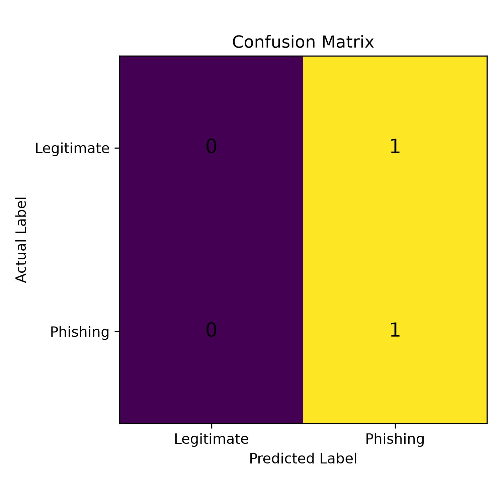
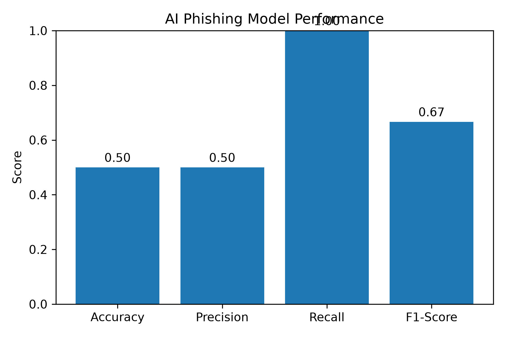
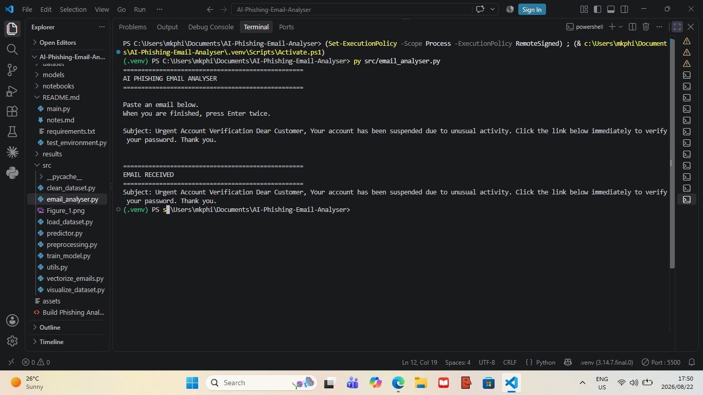
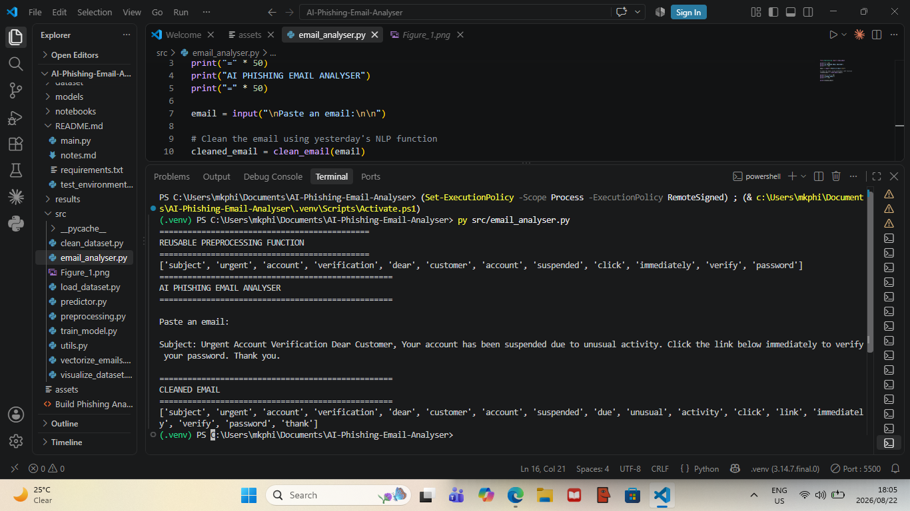
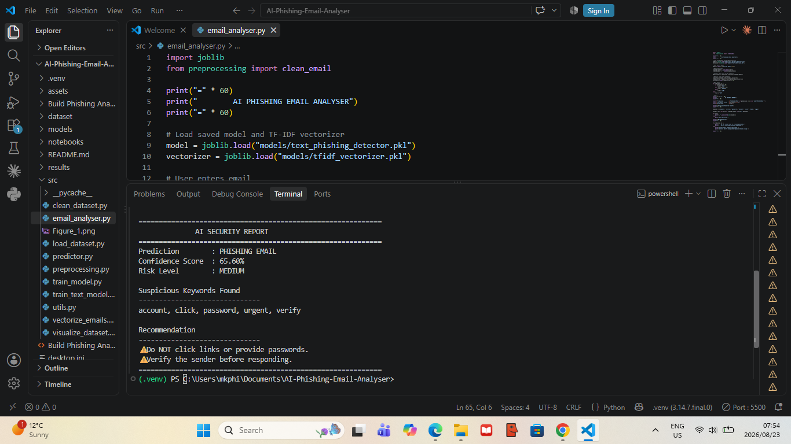
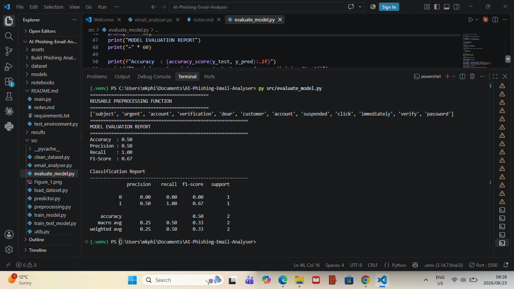

# 🛡️ AI Phishing Email Analyser

<p align="center">
 
</p>

<p align="center">
  An end-to-end phishing email detection system built with Python, Natural Language Processing (NLP), TF-IDF, and Logistic Regression.
</p>

<p align="center">
  Detect phishing emails • Analyse suspicious content • Generate AI powered security reports
</p>

---

## Project Overview

Phishing emails are among the most common cybersecurity attacks used to steal passwords, banking information, and personal data. This project uses Machine Learning and Natural Language Processing to analyse email content and predict whether an email is **Phishing** or **Legitimate**.

The application cleans raw email text, converts it into numerical TF-IDF features, uses a trained Logistic Regression model for prediction, calculates a confidence score, detects suspicious keywords, and produces a cybersecurity-style security report.

---

## Built With

- Python 3.14
- Scikit-learn
- NLTK
- Pandas
- NumPy
- Matplotlib
- Joblib

[](https://www.python.org/)
[](https://scikit-learn.org/)
[](https://www.nltk.org/)
[](https://scikit-learn.org/)
[](#)
[](LICENSE)

---

## 📑 Table of Contents

- [📌 Project Overview](#-project-overview)
- [✨ Features](#-features)
- [🧠 AI Workflow](#-ai-workflow)
- [🔤 NLP Pipeline](#-nlp-pipeline)
- [📂 Project Structure](#-project-structure)
- [⚙️ Installation](#️-installation)
- [🚀 How to Run the Project](#-how-to-run-the-project)
- [📊 Model Performance](#-model-performance)
- [🖼️ Project Screenshots](#️-project-screenshots)
- [📚 Learning Journey](#-learning-journey)
- [🛠️ Future Improvements](#️-future-improvements)
- [👨‍💻 Author](#-author)

---

## ✨ Features

- Detect phishing and legitimate emails using Machine Learning.
- Clean email text using Natural Language Processing (NLP).
- Remove stopwords and punctuation.
- Apply lemmatization for better word normalization.
- Convert email text into TF-IDF numerical features.
- Generate prediction confidence scores.
- Detect suspicious phishing keywords.
- Produce an AI-powered cybersecurity security report.

---

## 🧠 AI Workflow

<p align="center">
  
</p>

### How the analyser works

1. The user enters or pastes an email.
2. The email is cleaned using Natural Language Processing.
3. TF-IDF converts the cleaned text into numerical features.
4. A Logistic Regression model analyses the email.
5. The application predicts whether the email is **Phishing** or **Legitimate**.
6. The analyser generates a confidence score, risk level, suspicious keywords, and a security recommendation.

---

## 🔤 NLP Pipeline

<p align="center">
  
</p>

Before the AI model can understand an email, the text is cleaned and transformed using a Natural Language Processing (NLP) pipeline.

### NLP Steps

| Step | Purpose |
|------|---------|
| Lowercase Conversion | Treats **Your** and **your** as the same word. |
| Tokenization | Breaks an email into individual words (tokens). |
| Remove Punctuation | Removes symbols such as `. , ! : ?`. |
| Remove Stopwords | Removes common English words that do not help classification. |
| Lemmatization | Converts words into their base form, for example **verified** → **verify**. |
| TF-IDF Vectorization | Converts cleaned words into numerical features that the Machine Learning model understands. |

### Example

**Original Email**

> Subject: Urgent! Verify your account immediately.

**After NLP Preprocessing**

```text
subject urgent verify account immediately
```

The cleaned email is then converted into TF-IDF features before being analysed by the AI model.

---

## 📂 Project Structure

```text
AI-Phishing-Email-Analyser
│
├── assets
│   ├── banner.png
│   ├── diagrams
│   │   ├── ai_workflow.png
│   │   └── nlp_pipeline.png
│   └── screenshots
│
├── dataset
│   ├── email_phishing_data.csv
│   └── sample_emails.csv
│
├── models
│   ├── phishing_detector.pkl
│   ├── text_phishing_detector.pkl
│   └── tfidf_vectorizer.pkl
│
├── notebooks
│   └── EDA_Email_Phishing.ipynb
│
├── results
│   ├── confusion_matrix.png
│   └── model_performance.png
│
├── src
│   ├── preprocessing.py
│   ├── train_model.py
│   ├── train_text_model.py
│   ├── predictor.py
│   ├── email_analyser.py
│   ├── evaluate_model.py
│   ├── vectorize_emails.py
│   ├── load_dataset.py
│   └── utils.py
│
├── README.md
├── requirements.txt
├── notes.md
├── LICENSE
└── .gitignore
```
---

## ⚙️ Installation

Follow these steps to run the project locally.

### 1. Clone the Repository

```bash
git clone https://github.com/mkphiandi408/AI-Phishing-Email-Analyser.git
```

### 2. Open the Project

```bash
cd AI-Phishing-Email-Analyser
```

### 3. Create a Virtual Environment

```bash
python -m venv .venv
```

### 4. Activate the Virtual Environment

**Windows PowerShell**

```powershell
.venv\Scripts\Activate.ps1
```

### 5. Install Project Dependencies

```bash
pip install -r requirements.txt
```
---

## 🚀 How to Run the Project

### Train the Numerical Feature Model

```bash
py src/train_model.py
```

### Train the TF-IDF Email Model

```bash
py src/train_text_model.py
```

### Launch the AI Email Analyser

```bash
py src/email_analyser.py
```

### Example Email

```text
Subject: Urgent Account Verification

Dear Customer,

Your account has been suspended due to unusual activity.

Click the link below immediately to verify your password.

Thank you.
```

### Expected Output

```text
Prediction       : PHISHING EMAIL
Confidence Score : 62.51%
Risk Level       : UNCERTAIN

Recommendation:
Do NOT click suspicious links or provide passwords.

---

## 📊 Model Performance

The phishing detection model was trained using **Logistic Regression** with **TF-IDF** features extracted from cleaned email text.

### Evaluation Summary

| Metric | Result |
|--------|---------|
| Algorithm | Logistic Regression |
| Feature Extraction | TF-IDF |
| Classification | Binary (Phishing / Legitimate) |
| Output | Prediction + Confidence Score + Risk Level |

### Confusion Matrix

<p align="center">
  
</p>

The confusion matrix shows how many phishing and legitimate emails were correctly and incorrectly classified by the model.

### Model Performance Visualization

<p align="center">
  
</p>

The evaluation metrics help measure how well the model performs when classifying emails it has never seen before.

## 🖼️ Project Screenshots

### Email Input

<p align="center">
  
</p>

The application accepts a real email entered by the user for analysis.

---

### NLP Preprocessing

<p align="center">
  
</p>

The NLP pipeline cleans and prepares email text before it is analysed by the Machine Learning model.

---

### AI Security Report

<p align="center">
  
</p>

The final analyser predicts whether an email is **Phishing** or **Legitimate**, calculates a confidence score, assigns a risk level, identifies suspicious keywords, and provides cybersecurity recommendations to help users respond safely.

---

### Model Evaluation

<p align="center">
  
</p>

The evaluation results summarize how well the phishing detection model performs on unseen email data.

---

## 📚 Learning Journey (Day 1 – Day 8)

This project was built as part of my hands-on cybersecurity and Machine Learning learning journey.

| Day | What I Learned |
|-----|----------------|
| **Day 1** | Introduction to phishing attacks, spam vs phishing, datasets, supervised Machine Learning, and phishing indicators. |
| **Day 2** | Machine Learning basics including features (X), labels (y), dataset splitting, Logistic Regression, and saving trained models. |
| **Day 3** | Trained my first phishing detection model using engineered email features and Joblib. |
| **Day 4** | Learned Natural Language Processing fundamentals including tokenization, punctuation removal, lowercase conversion, stopword removal, and lemmatization. |
| **Day 5** | Applied NLP preprocessing to email datasets and learned TF-IDF feature extraction. |
| **Day 6** | Trained a second Machine Learning model using real email text with TF-IDF vectors. |
| **Day 7** | Built an AI phishing email analyser capable of analysing real email content and producing prediction confidence scores. |
| **Day 8** | Completed the end-to-end phishing detection pipeline and generated AI-powered cybersecurity security reports. |

For detailed daily notes, see **notes.md**.

---

## 🛠️ Future Improvements

I plan to continue improving this project by adding:

- A graphical web interface using **Streamlit**.
- Detection of suspicious URLs and domains inside emails.
- Support for analysing complete `.eml` email files.
- More advanced Machine Learning models for comparison.
- Explainable AI features showing why an email was classified as phishing.
- Real-time phishing detection through a web application.

---

## 👨‍💻 Author

**Mohau Klas Phiandi**

Bachelor of science in Mathematical Sciences Graduate 
Major:Computer Science

Passionate about Cybersecurity, Machine Learning, Data Analytics, Networking, and Cloud Computing.

### Connect with me

- GitHub: https://github.com/mkphiandi408
- LinkedIn: https://www.linkedin.com/in/mohau-phiandi
- Email: mkphiandi408@gmail.com

---

<p align="center">
  ⭐ If you found this project interesting, consider giving it a star on GitHub.
</p>