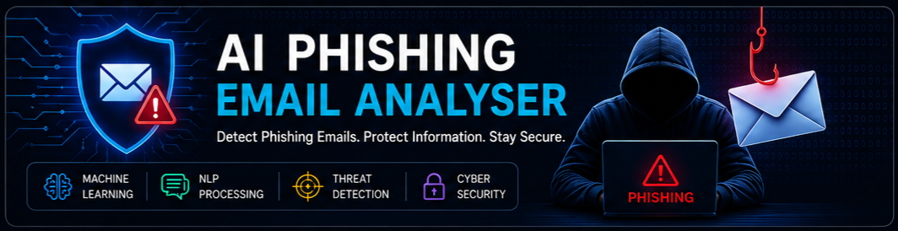
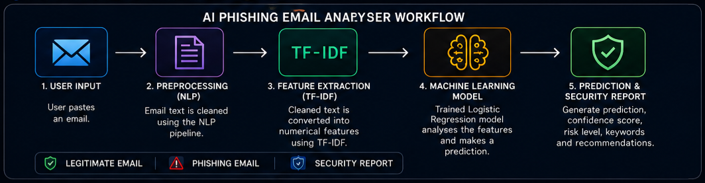
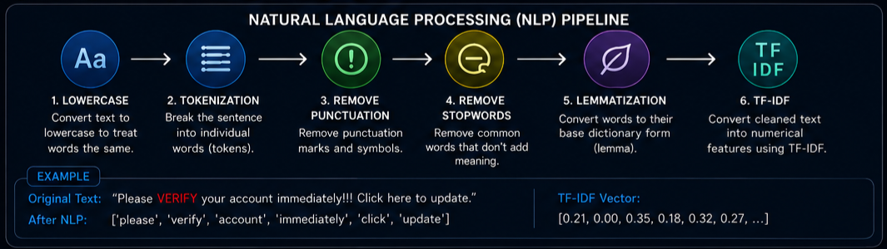

# 🛡️ AI Phishing Email Analyser

<p align="center">
 
</p>

<p align="center">
  An end-to-end phishing email detection system built with Python, Natural Language Processing (NLP), TF-IDF, and Logistic Regression.
</p>

<p align="center">
  Detect phishing emails • Analyse suspicious content • Generate AI-powered security reports
</p>

---

## Project Overview

Phishing emails are among the most common cybersecurity attacks used to steal passwords, banking information, and personal data. This project uses Machine Learning and Natural Language Processing to analyse email content and predict whether an email is **Phishing** or **Legitimate**.

The application cleans raw email text, converts it into numerical TF-IDF features, uses a trained Logistic Regression model for prediction, calculates a confidence score, detects suspicious keywords, and produces a cybersecurity-style security report.

---

## Built With

- Python 3.14
- Scikit-learn
- NLTK
- Pandas
- NumPy
- Matplotlib
- Joblib

[](https://www.python.org/)
[](https://scikit-learn.org/)
[](https://www.nltk.org/)
[](https://scikit-learn.org/)
[](#)
[](LICENSE)

---

## 📑 Table of Contents

- [📌 Project Overview](#-project-overview)
- [✨ Features](#-features)
- [🧠 AI Workflow](#-ai-workflow)
- [🔤 NLP Pipeline](#-nlp-pipeline)
- [📂 Project Structure](#-project-structure)
- [⚙️ Installation](#️-installation)
- [🚀 How to Run the Project](#-how-to-run-the-project)
- [📊 Model Performance](#-model-performance)
- [🖼️ Project Screenshots](#️-project-screenshots)
- [📚 Learning Journey](#-learning-journey)
- [🛠️ Future Improvements](#️-future-improvements)
- [👨‍💻 Author](#-author)

---

## ✨ Features

- Detect phishing and legitimate emails using Machine Learning.
- Clean email text using Natural Language Processing (NLP).
- Remove stopwords and punctuation.
- Apply lemmatization for better word normalization.
- Convert email text into TF-IDF numerical features.
- Generate prediction confidence scores.
- Detect suspicious phishing keywords.
- Produce an AI-powered cybersecurity security report.

---

## 🧠 AI Workflow

<p align="center">
  
</p>

### How the analyser works

1. The user enters or pastes an email.
2. The email is cleaned using Natural Language Processing.
3. TF-IDF converts the cleaned text into numerical features.
4. A Logistic Regression model analyses the email.
5. The application predicts whether the email is **Phishing** or **Legitimate**.
6. The analyser generates a confidence score, risk level, suspicious keywords, and a security recommendation.

---

## 🔤 NLP Pipeline

<p align="center">
  
</p>

Before the AI model can understand an email, the text is cleaned and transformed using a Natural Language Processing (NLP) pipeline.

### NLP Steps

| Step | Purpose |
|------|---------|
| Lowercase Conversion | Treats **Your** and **your** as the same word. |
| Tokenization | Breaks an email into individual words (tokens). |
| Remove Punctuation | Removes symbols such as `. , ! : ?`. |
| Remove Stopwords | Removes common English words that do not help classification. |
| Lemmatization | Converts words into their base form, for example **verified** → **verify**. |
| TF-IDF Vectorization | Converts cleaned words into numerical features that the Machine Learning model understands. |

### Example

**Original Email**

> Subject: Urgent! Verify your account immediately.

**After NLP Preprocessing**

```text
subject urgent verify account immediately
```

The cleaned email is then converted into TF-IDF features before being analysed by the AI model.

---

## 📂 Project Structure

```text
AI-Phishing-Email-Analyser
│
├── assets
│   ├── banner.png
│   ├── diagrams
│   │   ├── ai_workflow.png
│   │   └── nlp_pipeline.png
│   └── screenshots
│
├── dataset
│   ├── email_phishing_data.csv
│   └── sample_emails.csv
│
├── models
│   ├── phishing_detector.pkl
│   ├── text_phishing_detector.pkl
│   └── tfidf_vectorizer.pkl
│
├── notebooks
│   └── EDA_Email_Phishing.ipynb
│
├── results
│   ├── confusion_matrix.png
│   └── model_performance.png
│
├── src
│   ├── preprocessing.py
│   ├── train_model.py
│   ├── train_text_model.py
│   ├── predictor.py
│   ├── email_analyser.py
│   ├── evaluate_model.py
│   ├── vectorize_emails.py
│   ├── load_dataset.py
│   └── utils.py
│
├── README.md
├── requirements.txt
├── notes.md
├── LICENSE
└── .gitignore
```
---

## ⚙️ Installation

Follow these steps to run the project locally.

### 1. Clone the Repository

```bash
git clone https://github.com/mkphiandi408/AI-Phishing-Email-Analyser.git
```

### 2. Open the Project

```bash
cd AI-Phishing-Email-Analyser
```

### 3. Create a Virtual Environment

```bash
python -m venv .venv
```

### 4. Activate the Virtual Environment

**Windows PowerShell**

```powershell
.venv\Scripts\Activate.ps1
```

### 5. Install Project Dependencies

```bash
pip install -r requirements.txt
```
---

## 🚀 How to Run the Project

### Train the Numerical Feature Model

```bash
py src/train_model.py
```

### Train the TF-IDF Email Model

```bash
py src/train_text_model.py
```

### Launch the AI Email Analyser

```bash
py src/email_analyser.py
```

### Example Email

```text
Subject: Urgent Account Verification

Dear Customer,

Your account has been suspended due to unusual activity.

Click the link below immediately to verify your password.

Thank you.
```

### Expected Output

```text
Prediction       : PHISHING EMAIL
Confidence Score : 62.51%
Risk Level       : UNCERTAIN

Recommendation:
Do NOT click suspicious links or provide passwords.
```